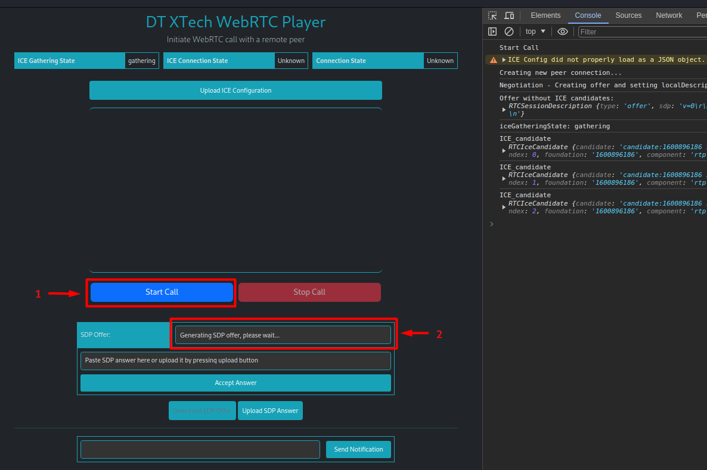
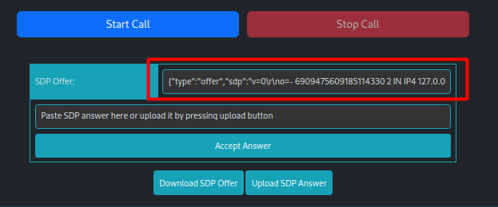
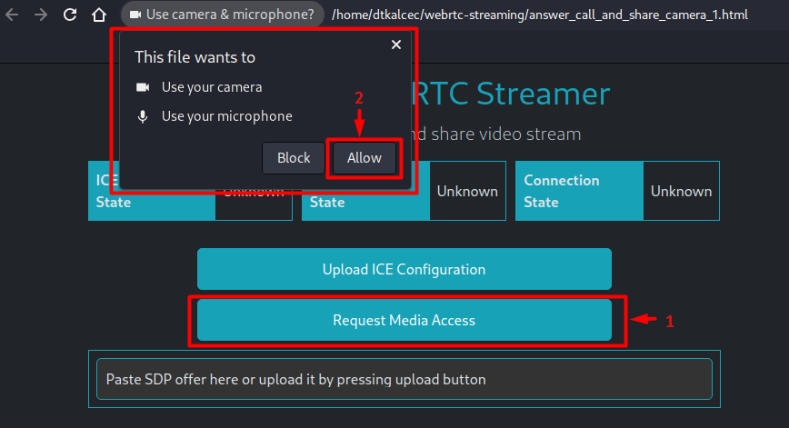
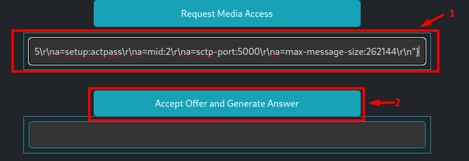
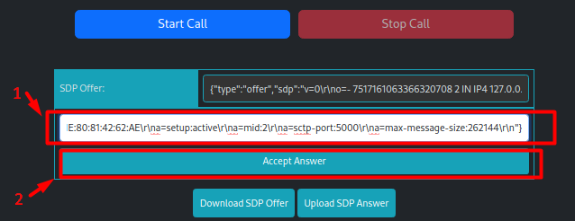
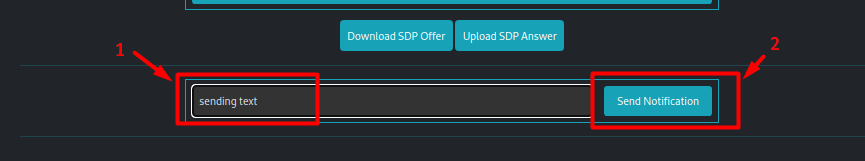
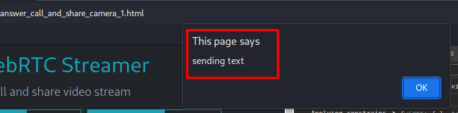
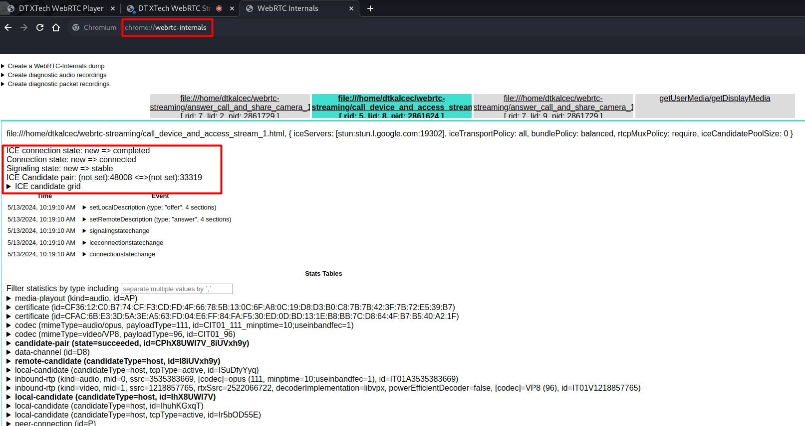

# Simple WebRTC streaming with manual signaling (no signaling server)

This project provides a simple, fully functional example of WebRTC streaming between peer/caller/initiator and media streaming source/answerer. The code can be directly run in a browser without any additional dependencies.

## Table of Contents

- [Introduction](#introduction)
- [Features](#features)
- [Installation](#installation)
- [Usage](#usage)
- [Acknowledgements](#acknowledgements)
- [Debug](#debug)
- [References](#references)
- [License](#license)
- [Changelog](#changelog)

## Introduction

The project consists of two .html files [call_device_and_access_stream_1.html](call_device_and_access_stream_1.html) and [answer_call_and_share_camera_1.html](answer_call_and_share_camera_1.html) which can be opened in a browser.

The first is used as a caller to create an SDP offer with all ICE candidates included, and after receiving and accepting the SDP answer it starts a video stream and opens the data channel to send/receive notifications.

The second file will capture the local media device (camera, microphone), and after receiving and accepting the SDP offer it will create an SDP answer that can be pasted/loaded in the caller. After the answer is accepted by the caller,
the video stream will appear on the caller's page.

## Features

- communication between the media streamer and one or multiple callers - streamer and caller can be: two tabs in the same browser or the two separate browsers running on a private or public network
- receiving video stream on the caller side
- sending notifications between the tabs or browsers
- option to encrypt SDP before download and decrypt on upload (AES256)
- option to load alternative ICE configuration to use additional STUN and TURN servers

## Installation

The two .html files can be opened directly in any browser or hosted by an HTTP server.

## Usage

### Method 1: Manually copy SDP between two tabs/browsers

1. Open [call_device_and_access_stream_1.html](call_device_and_access_stream_1.html) in one tab and press the "Start Call" button to create an SDP offer:

    NOTE1: Before pressing the "Start Call" button, it is also possible to load alternative ICE configuration in .json format by pressing the "Update ICE Configuration" button. An example of the file is provided [here](ICE_config_example.json).

    NOTE2: It is possible to use Ctrl+Shift+C to inspect the console output of the loaded HTML page(shown on the right side of the image below)
   
    

    After all ICE candidates have been gathered, the SDP offer will appear in the text box:
   
    

2. Copy the SDP offer to the clipboard.

3. Open [answer_call_and_share_camera_1.html](answer_call_and_share_camera_1.html) in the second tab, press the "Request Media Access" button and then accept access to the camera and microphone:

    

4. Paste the content of the clipboard (SDP offer) to the proper text box and click the "Accept Offer and Generate Answer" button:

    

    This will create an SDP answer in the second text box. Copy the content to the clipboard and switch back to the first tab.

5. In the first tab paste the content of the clipboard (SDP answer) to the proper text box and press the "Accept Answer" button:

    

6. The video stream should appear on the screen.

7. (optional) Write some text to the textbox near the "Send Notification" button and press the button. It should send a notification to the second tab. The same can be done from the second tab.

    First tab:
    
    

    Second tab:

    

### Method 2: Download and upload SDP files to/from the filesystem

1. Open [call_device_and_access_stream_1.html](call_device_and_access_stream_1.html) in one tab and press the "Start Call" button to create an SDP offer.

    NOTE1: Before pressing the "Start Call" button, it is also possible to load alternative ICE configuration in .json format by pressing the "Update ICE Configuration" button. An example of the file is provided [here](ICE_config_example.json).

    NOTE2: It is possible to use Ctrl+Shift+C to inspect the console output of the loaded HTML page(shown on the right side of the image below)

3. Press the "Download SDP Offer" button to download the offer in .json format. Additionally, there will be a prompt to enter an encryption password. If a password is entered the file will be encrypted. Otherwise, press "Cancel" to download the file as plain text.

4. Open [answer_call_and_share_camera_1.html](answer_call_and_share_camera_1.html) in the second tab and accept access to the camera and microphone.

5. Press the "Upload SDP Offer" button and select the previously downloaded SDP file. If the file has been encrypted, there will be a prompt to enter the password.

6. Press the "Accept Offer and Generate Answer" button and then press the "Download SDP Answer" button to download the answer in .json format. Additionally, there will be a prompt to enter an encryption password. If a password is entered the file will be encrypted. Otherwise, press "Cancel" to download the file as plain text. After downloading, switch back to the first tab.

7. In the first tab press the "Upload SDP Answer" button and then press the "Accept Answer" button. The video stream should appear on the screen.

8. (optional) Write some text to the textbox near the "Send Notification" button and press the button. It should send a notification to the second tab. The same can be done from the second tab.

## Acknowledgements

This is my first code written in HTML/Javascript so it could be written more efficiently. All the code(CSS, HTML, JS) is bagged to a .html file because of simplicity and because it is easy to copy and paste it anywhere. For example, you can copy the content and paste it to a .html file on the phone, which can then be opened in the phone's browser. If the [answer_call_and_share_camera_1.html](answer_call_and_share_camera_1.html) is opened on the phone, a browser will probably not allow access to phone's camera and microphone because of the security reasons so only [call_device_and_access_stream_1.html](call_device_and_access_stream_1.html) can be used on the phone to access the stream shared by [answer_call_and_share_camera_1.html](answer_call_and_share_camera_1.html).

If your router operates behind symmetric NAT or CGNAT, it may be necessary to include a TURN server in the configuration. This enables communication between the isolated public networks.

I recommend comparing the provided .html files side by side to understand the difference between a caller and an answerer since the majority of the code is duplicated with minor differences.

## Debug

Since the implementation of error handling is not great and it will not show info directly on the page, I recommend opening the inspection view with Ctrl+Shift+C and looking into the "Console" tab to see the logs.

In an additional tab, it is possible to open the URL "chrome://webrtc-internals/" after WebRTC communication has been initialized. This will provide a lot of useful information:

## Changelog

### [1.0.0] - 2024-05-14

- Initial release

## References
- https://mac-blog.org.ua/webrtc-one-to-one-without-signaling-server/
- https://github.com/marcus2vinicius/webrtc-raspberry-js

## License

[MIT License](LICENSE)

